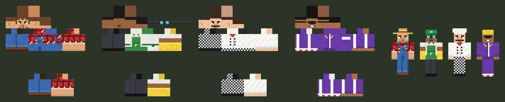

# KushCraft 9.0 – the drug economy for an anarchy server (Paper 26.3)

A **server-side only** Paper plugin for a drugs-themed anarchy PvP server. Players grow **102 strains**, cook **26 drugs** step by step, hire workers and climb a **12-rank ladder** that takes a full season. In one jar:

- strains with climates, custom plants that also **grow wild**, 34 effects, strain breeding with **Mythic** and **Exotic** strains;
- **workers** (Farmhand, Dryer, Cook, Runner) limited by rank, who keep working at half speed while you're away;
- cartels, a sales leaderboard, 52 achievements, an admin panel;
- a living market where **money only comes from selling drugs**;
- **season resets** with verified backups.

Everything players own is in a **database** (SQLite), saved every few ticks in one transaction at a time. Every money event is **logged**, and KushCraft **is the server's Vault economy**.

Players don't install any mods. The plugin builds its own resource pack (32px art, 3D plants and blocks, worker skins, animated Mythic and Exotic buds, menu art and recipe pictures) and every player gets it when they join.

**Download:** [`release/KushCraft-9.0.0.jar`](release/KushCraft-9.0.0.jar). Drop it in `plugins/` (with Vault) and restart. Players get the textures automatically.

**For the server owner:**

- [`docs/PROGRESSION.md`](docs/PROGRESSION.md): the rank ladder and how long each rank takes;
- [`docs/TESTING-CHECKLIST.md`](docs/TESTING-CHECKLIST.md): dupe and exploit tests before launch;
- [`docs/STRUCTURE.md`](docs/STRUCTURE.md): code map, command collisions, load notes, and dead code waiting for your OK.

| Items | Plants | Blocks |
|---|---|---|
|  |  |  |




## The menu

Open it with **`/kush`**, **Shift + F**, or the **KushCraft Menu** book. There are five panels. In the top bar next to them are the glowing **Next** button (your next step, see *Getting started*) and your money. Admins also get a red **Admin** button.

| Panel | What's there |
|---|---|
| **Shop** | seeds of every strain (page arrows; **Mythic seeds** on their own page), **Gear & Workers**, the **Market** (contracts and flooded products) and selling (click product, or **Sell all**) |
| **Drugs** | every product in one row per kind; click one to see its recipe picture |
| **Trade** | spend your money on 11 shelves: lab ingredients, ores, farming & food, wood, building blocks, colours, decoration, redstone, tools, mob drops, the Nether. **Buy only** |
| **Cartel** | your cartel (bank, level, members), how cartels work, the cartel **shipment** and **Top Dealers** |
| **Awards** | 52 achievements on two pages, greyed out until you unlock them |

The **Drug Lab** block opens on **Cook**, with **Roll**, **Dry** and **Mix** tabs and an **Upgrade** button. Recipes you have everything for glow; a red line under a recipe says what's missing **and where to get it**.

## Getting started

On their **first join of each season**, players get the menu book and a small starter kit (2 OG Kush seeds and 2 fertilizer). Once the resource pack is loaded, the server guide opens. It's also **`/menu`**, with pages for **Economy**, **Ranks**, **Rules** and **Community** (Discord and vote links). All its text is in `menus.yml`.

In `/kush`, the glowing **Next** button always shows the next step:

1. **Plant a seed**: buy one in the Shop, or break grass (the biome decides the strain).
2. **Harvest it**: right-click the plant when it's fully grown. Sneak + right-click harvests all your ripe plants around it.
3. **Get a Drug Lab**: Shop > Gear & Workers, or craft one.
4. **Dry your buds**: Drug Lab > Dry (30 seconds).
5. **Roll or cook** something.
6. **Sell** your product.
7. **Pick a wild plant**: they grow out in the world.

`/kush start` shows all the steps.

## Ranks (`/rankup`)

Everyone starts at **Fresh Meat** and climbs to **Drug Lord** (12 ranks). The next rank needs **all three** of:

* **Money**, paid on rank-up. It roughly doubles each rank: $3,000 for rank 2, $10,000,000 for rank 12.
* **Active playtime** this season. AFK time doesn't count; only looking around, clicking, building and commands do.
* **Real time** since the last rank-up: 12 hours early on, up to 14 days at the top.

Ranks give **worker slots** (1 → 8) and a tag in the tab list. A dedicated player reaches the top in about a season, never in a weekend: see [`docs/PROGRESSION.md`](docs/PROGRESSION.md). Every number is in `config.yml` under `ranks.ladder`. The numbers there are a **proposal for you to adjust**.

## Textures for everyone

By default (`resource-pack.url: auto`) players download the pack of **this exact KushCraft version** from GitHub, so it works on every host, including Shockbyte and other hosts that only open the game port. The plugin checks the file's hash itself and checks it again every 20 minutes. If a player's download fails, it checks the link and sends the pack once more. Players who said no get a clickable message, or can type `/kush pack`.

## Workers

Shop > **Gear & Workers** has a hiring board. Buy a worker contract, then right-click the ground where they should work. Workers are a **slow investment**, not an income on their own:

| Worker | Price | Pay | What they do |
|---|---|---|---|
| **Farmhand** | $60,000 | $10 a job | harvests your ripe plants around them and replants, plants seeds on empty farmland and Planters, fertilizes |
| **Dryer** | $45,000 | $8 a job | hangs fresh buds on your Drug Lab's racks and takes them off dry |
| **Cook** | $75,000 | $16 a batch | cooks **the drug you pick** at your Drug Lab, or rolls joints or blunts |
| **Runner** | $55,000 | 15% of sales | sells everything your workers make (the money goes to your wallet) and carries things between your workers and chests |

* **Worker slots come from your rank:** 1 at Fresh Meat, up to 8 at Drug Lord. At most 6 workers (anyone's) stand in one chunk.
* **You supply them.** Workers don't buy anything (`workers.auto-buy: false`). Put seeds, fertilizer, papers and ingredients in a chest near them, or press **Supply your crew** in `/kush workers`, which hands each worker what they use from your inventory. A worker without supplies, money for wages or room stops and says why.
* **While you're away** (their chunk is unloaded), they keep working at **half speed** for up to **12 hours**. That time is caught up when the chunk loads again, into their satchels and your chests. Server downtime doesn't count.
* **They're in the world:** workers, their satchels and your chests can be found by other players.

  Attacking workers (`pvp.worker-raids`) is **off** until you've reviewed it. When it's on, a knocked-out worker drops their satchel and sleeps for 30 minutes. Protected areas and your own cartel are respected.
* **The work chain runs by itself:** your workers within 32 blocks of each other are a crew. The chain is Farmhand → Dryer (fresh buds) → Cook (dried buds) → Runner (joints, vape pens…), and each worker takes what they need from the others and from your chests, trapped chests and barrels.
* **Right-click** a worker for their menu: their satchel (click to take, click your items to give), the chests they use, rename, pause, **train** ($50,000 / $125,000 for levels 2 and 3: more reach, less rest) and dismiss (you get the contract and satchel back).
* `/kush workers` lists all of yours, with **Collect everything** and **Supply your crew**.

## Wild plants

Plants grow by themselves out in the world, 20–56 blocks from players and never near anyone's farm. Cannabis is the strain of the biome, coca grows in jungles and savannas, poppies on plains, peyote in deserts and magic mushrooms in dark forests, swamps and mushroom fields. **Anyone can pick them** for buds and seeds. Unpicked ones wither after 6 hours (all of it is in `config.yml` under `wild`).

## Animals

Right-click an animal with a joint, an edible or any drug and its **eyes go red**. It's high for 90 seconds: slow and dopey on weed and downers, the zoomies on uppers, colours around its head on psychedelics.

## Strains & climates

There are **102 strains** and every one looks different: its own bud colour (jet black, ghost white, acid lime, hot magenta, ultraviolet…), leaf colour, hair colour and bud shape (**classic**, **foxtail**, **popcorn** or **spear**), many with a **second colour in a pattern**: frosted **tips**, tiger **stripes**, leopard **spots**, **marble**, **speckles**, glowing **halo** edges or **split** two-faced buds – on the seeds, the buds and the growing plant. Each has its own effects, flavour and climate. 61 are sold in the Shop (about $100 up to $1,900), plus **17 Mythic ones** on their own page (about $13,500 each); the rest are found in the wild or bred.

New in 8.0: Banana Kush, Jungle Juice, Frostbite, Desert Rose, Lotus Haze, Thunderhead, Black Cherry Punch, Kryptonite and Sunstone in the Shop, Fairy Dust and Mangrove Mist in the wild, four new Mythic strains (Starfall OG, Koi Kush, Lava Lamp, Frozen Rainbow) and a new Exotic one, Nebula Dream.

Every strain loves one of six climates (shown on its seeds):

| Climate | Where |
|---|---|
| Tropical | jungles |
| Desert | deserts, savannas, badlands, the Nether |
| Temperate | plains, forests |
| Wetland | swamps, rivers, beaches |
| Cold | snow, taiga, ice |
| Mountain | hills, meadows, cherry groves, anything above y 100 |

In its own climate a plant grows **50% faster**, gets **+1 ★** and **+1 bud**. In the opposite climate it grows at half speed with −1 ★ (a **Grow Lamp** nearby fixes that, like a greenhouse).

### Breeding, Mythic & Exotic strains

**Drug Lab > Mix:** cross two seeds. The child is random: effects, potency, climate, colours, two-tone pattern and bud shape come from the parents, or mutate into something new (weird colours included).

* **Mythic** (about **1 in 15** crosses, **about 1 in 4 from two Legendary parents**, more with a Mythic parent): animated buds and plants – **rainbow**, **galaxy**, **golden**, **crystal**, **neon**, **inferno**, **aurora**, **toxic**, **sakura**, **plasma**, **blood moon**, **ocean** or **candy**. They sparkle, some glow at night, and they sell for **4×**. **You can buy Mythic seeds in the Shop** (last page, `shop.mythic-seed-multiplier` × the normal price; `shop.mythic-seeds: false` to stop selling them), and they grow wild once in a blue moon.
* **Exotic** – rarer still, and **the only way to get one is crossing two Mythic strains** (3%, more with Exotic parents): **void**, **prism**, **celestial**, **phoenix**, **quantum** or **eclipse** buds that sell for **7×**. Eleven famous Exotic strains (Event Horizon, Prismatic Runtz, Phoenix Tears, Nebula Dream…) can only be found by crossing the right two Mythic strains. Exotic strains are never sold and never wild.

### Effects

Strains carry up to 4 of 27 strain effects, and the hard drugs have their own. **None of them help in a fight**: no strength, no damage resistance, no invisibility. They're about farming, mining, getting around and having a weird time:

| Effect | Now |
|---|---|
| Focus | see in the dark and find better loot |
| Rage | smash through stone like a machine (fast mining), but you get hungry |
| Pain Relief | no fall damage, and you heal slowly |
| Ghost | monsters don't notice you |
| Couch Lock | slow as a sloth, but you never get hungry |
| Zen | stand still to heal fast |
| Hyper | still insane speed, without the strength |

## Drugs (Drug Lab > Cook)

Recipes follow the real process **loosely**: many drugs take two or three cooks with an in-between product. They use game items and a made-up **Lab Solvent**, never real chemistry. 27 recipes, 15–60 seconds each. **Shift-click** cooks up to 4 batches.

**Weed is kept simple:** fresh bud → dried bud → joint, blunt (rolled) or **vape pen** (4 dried buds + solvent + 2 iron nuggets + a glass pane). Kief, hash, wax, moon rocks, canna butter, brownies and gummies are no longer made; old ones still work and still sell.

| Chain | Steps |
|---|---|
| LSD | wheat → ergot → **ergot extract** → LSD tabs on paper |
| Cocaine | coca leaves → **coca paste** → cocaine → crack (+ water, bone meal) |
| Heroin | **4 poppy seeds → morphine base** (right in a crafting table, or a Cook makes it) → heroin |
| Oxy | morphine base + sugar + solvent → **oxy pills** |
| Lean | opium + honey → **cough syrup** → lean |
| Ayahuasca | glow berries → DMT → **ayahuasca** (+ vines, water) |
| The rest | shroom tea, **shroom chocolate**, mescaline, meth, **speed**, ecstasy, pixie dust, angel dust, ketamine, **xanny bars**, **moonshine**, **laughing gas** |

**Morphine base** comes straight from poppy seeds: put **4 Poppy Seeds** in a crafting table. Harvested poppies drop 2–4 seeds (one to plant again, the rest for morphine); opium is still made from poppy pods for cough syrup and lean. Every step is worth more than what went in, and the in-between products sell too. Water bottles come back empty.


## Cartels

A cartel is a **team**. Start one for $12,500 (Cartel panel) and invite players from the members list, or `/kush cartel invite <player>`.

* **Bank:** every sale a member makes adds **5%** on top into the bank (nobody pays it). Members put money in; the boss takes it out.
* **Levels:** the boss spends the bank on levels. Each one gives **every member better prices** and more member slots:

| Level | Cost | Members | Better prices |
|---|---|---|---|
| Crew | – | 4 | – |
| Gang | $50,000 | 6 | +4% |
| Syndicate | $200,000 | 8 | +8% |
| Cartel | $600,000 | 12 | +12% |
| Empire | $1,750,000 | 16 | +16% |

* **Shipments:** each cartel gets a big order, e.g. 75 cocaine within 24 hours. Every member can deliver part of it and gets paid for it; when it's full the bank gets a big bonus.
* **Top Dealers:** the best players and the best cartels.

## Dealer titles: whoever sells the most

| Place | Title | Bonus on every sale |
|---|---|---|
| #1 | Cartel Boss | +15% |
| #2 | Kingpin | +12% |
| #3 | The Plug | +10% |
| top 5 | Supplier | +7% |
| top 10 | Hustler | +5% |
| top 25 | Dealer | +2% |
| everyone else | Street Seller | – |

Titles reset with the season (`dealer-titles` in `config.yml`). The tab list shows `[Rank] Name · Cartel`.

## Economy

* **KushCraft owns the money.** Balances are whole cents in the database, and every change is in the transaction log (`/kush log [player]`). With **Vault** installed, KushCraft *is* the Vault economy, so other plugins pay into the same wallets (logged as VAULT_IN / VAULT_OUT). `/balance`, `/pay` and `/baltop` are KushCraft's; turn EssentialsX's economy commands off (see *Installing*).
* **Money only comes from selling drugs:** the Shop, contracts, cartel shipments and your Runners. Seeds, gear and vanilla items don't sell. Jobs and award cash are off (`jobs.enabled`, `awards.cash-rewards`).
* **Everything you buy is expensive** (about 5× 8.0):
  * seeds about $100–1,900 by strain;
  * papers 8 for $40, solvent 8 for $90;
  * a Drug Lab $3,250 (or craft one);
  * Trade: a diamond $9,750.

  What the dealer **pays** for product is unchanged: dried bud $20, a joint $32, a vape pen $150, cocaine $110, heroin $150, DMT $160. Rarer and stronger strains sell for more (Mythic 4×, Exotic 7×). The full table is in [`docs/PROGRESSION.md`](docs/PROGRESSION.md).
* **The market fights back:** every item you sell lowers the price of the next one, and prices recover over time. Sell a mix.
* **Trade only sells**, and there's no OP PvP gear and nothing from the End.
* **Dying costs 20% of the cash in your wallet** (`pvp.death-cash-lost`). Nobody gets it, so farming your own alt doesn't pay. Otherwise PvP is plain vanilla: no bounties.
* **Rate limits:** one `/pay` a second, one hire every 2 seconds, Shop buys 150 ms apart, rank-up clicks guarded.

## Seasons, backups and the log

* **`/kush reset`** (console or `kushcraft.reset`) starts a new season:
  1. it saves everything, makes a backup and **checks it** (integrity, player count, total money, sha256);
  2. it shows you the backup and gives a 6-character code;
  3. **`/kush reset confirm <code>`** within 5 minutes runs it. A second backup is made just before the wipe, which is one database transaction: all or nothing.

  Scopes:
  * `economy`: money, ranks, playtime, workers;
  * `kushcraft` (**default**): plus KushCraft plants, Drug Labs, cartels, awards, sales and market prices;
  * `everything`: plus inventories, ender chests, XP and bred strains.

  Builds and chests are never touched. Everyone gets the starter kit and the guide again.
* **`/kush backup`** makes a verified backup any time. `/kush backups` lists them. To restore one, stop the server and copy the backup's `kushcraft.db` over the live one.
* **`/kush db`** shows the database, the saves and the worker load. **`/kush log [player] [page]`** shows the transaction log.

## Achievements

There are 52 awards: grow in every climate, pick a wild plant, cook every recipe, hire a Cook, run a full **Assembly Line** (Farmhand, Dryer, Cook and Runner together), give an animal red eyes, deliver a cartel shipment, build an Empire, breed a Mythic strain, breed an Exotic one, sell $1,000,000 and more. They're also real **advancements** with their own *KushCraft* tab (press L).

## Installing

1. **Paper 26.3** (Java 25) and **Vault**. Put the jar in `plugins/` and start the server.
2. Players get the textures from GitHub when they join (`resource-pack.url: auto`). To host the pack yourself, set `url: ''` and open port 8163, or paste a direct link to your own copy.
3. **EssentialsX:** KushCraft's money commands must win. In EssentialsX's `config.yml`:
   * set `disabled-commands: [balance, bal, money, pay, baltop, balancetop, eco, sell, worth, setworth]`;
   * keep them out of `overridden-commands`.

   The start-up log says *"Commands: /menu, /rankup, /balance, /pay and /baltop are KushCraft's"* when it's right. See [`docs/STRUCTURE.md`](docs/STRUCTURE.md).
4. Edit `menus.yml` (rules, Discord and vote links) and, if you like, the rank ladder, then `/kush reload`.

**Updating from 8.0:** replace the jar and restart.

* `config.yml` upgrades itself to version 13:
  * the old file is kept as `config-old-v11.yml`;
  * the 9.0 prices, the ladder and the new sections come in;
  * your own settings are carried over: growth, effects, resource pack, dealer titles, death cash loss, give-guide.
* Your 8.0 data files are imported into the database once: balances, sales, workers, plants, Drug Labs, cartels, awards and the market. They are then moved to `legacy-yaml/`.
* For a fresh start after that, run `/kush reset`.

## Admin panel

Admins (op or `kushcraft.admin`) get a red **Admin** button in the menu's top bar (or `/kush admin`):

* **Players & items:** give any item, seeds or buds of any strain (bred ones too), manage players (add or take money, set lifetime sales, starter kit, sober up, teleport), see every worker, level up, fund or disband cartels.
* **Around you:** grow every plant within 16 blocks, finish every Drug Lab (cooking and drying), sober up, give yourself the starter kit.
* **Market:** new hot item, reset prices, new contracts, start or stop a market boom, new cartel shipments.
* **Server:** reload the config, resend the pack to everyone, turn workers on or off, server stats.

## Commands

| Command | Permission | |
|---|---|---|
| `/menu` | everyone | the server guide: Economy, Ranks, Rules, Community |
| `/rankup` | everyone | your rank, what the next one needs, rank up |
| `/balance` (`/bal`, `/money`), `/pay <player> <amount>`, `/baltop` | everyone | money |
| `/kush` (`/k`) | `kushcraft.use` | the KushCraft menu |
| `/kush shop` / `gear` / `market` / `drugs` / `trade` / `cartel` / `top` / `awards` | `kushcraft.use` | open a panel |
| `/kush start` | `kushcraft.use` | getting started: your next steps |
| `/kush sell` | `kushcraft.use` | sell all your product |
| `/kush workers` | `kushcraft.use` | your workers, from anywhere |
| `/kush playtime` | `kushcraft.use` | your active playtime this season |
| `/kush cartel invite <player>` / `join <cartel>` / `leave` | `kushcraft.use` | cartels |
| `/kush guide` / `pack` / `strains` | `kushcraft.use` | handbook, re-send the pack, all strains |
| `/kush admin` | `kushcraft.admin` | the **admin panel** |
| `/kush items`, `/kush give <player> <item> [amount] [strain] [quality]` | `kushcraft.admin` | items |
| `/kush money <player> <amount>` / `sales <player> <amount>` | `kushcraft.admin` | set a balance / lifetime sales (logged) |
| `/kush rank <player> <1-12>` / `playtime <player> <hours>` | `kushcraft.admin` | set a rank / playtime (logged) |
| `/kush log [player] [page]` | `kushcraft.admin` | the transaction log |
| `/kush backup` / `backups` / `db` | `kushcraft.admin` | backups and the database |
| `/kush reset [economy\|kushcraft\|everything]`, `/kush reset confirm <code>` | `kushcraft.reset` | new season (backup first) |
| `/kush reload` | `kushcraft.admin` | reload the config, menus and strains |
| `/kush selftest` / `selftest live` / `selftest seed` | console | the built-in tests (test servers only) |

## Building from source

```bash
cd kushcraft
mvn package                       # JDK 25; jar in target/
python3 tools/gen_assets.py       # redraw all art, menus and recipe pictures (needs Pillow)
python3 tools/validate_pack.py    # checks the pack against the Java code
mvn clean package                 # rebuild the jar from clean, then:
python3 tools/make_pack_zip.py    # release/KushCraft-pack-<version>.zip (url: auto) + KushCraft-pack.zip
```

Always build from clean: old files left in `target/` would end up in the jar's pack. A released `KushCraft-pack-<version>.zip` must never change afterwards, because servers running that version download it.

GitHub Actions builds against the real Paper 26.3 API and boots a real Paper 26.3 server with Vault five times:

1. **A fresh install.** It runs:
   * `/kush selftest` (more than 26,000 checks, including atomic money and a rolled-back failing save);
   * `/kush selftest live` (four workers work a farm on the server clock with supplies from a chest; the worker tick has to stay under 1.5 ms on average);
   * the Vault bridge, a verified backup, and a full **season reset** of a seeded player with money, a rank, a worker, a plant and a cartel.

   It checks the database after the wipe and the backups before it.
2. **A restart:** the new season is kept.
3. **An upgrade from 8.0:** the YAML data files and the old config are imported and checked row by row.
4. **An 8.1 config upgrade.**
5. **The built-in pack server.**
