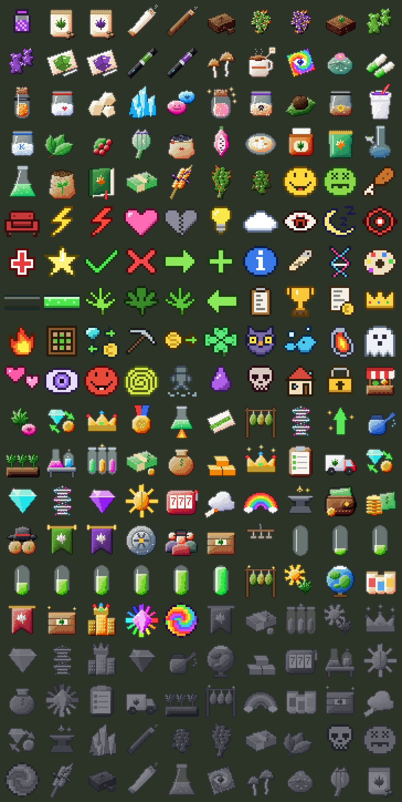
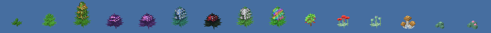
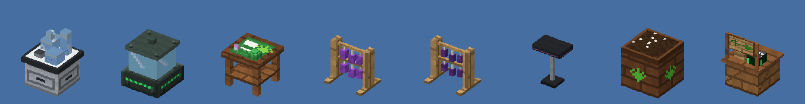
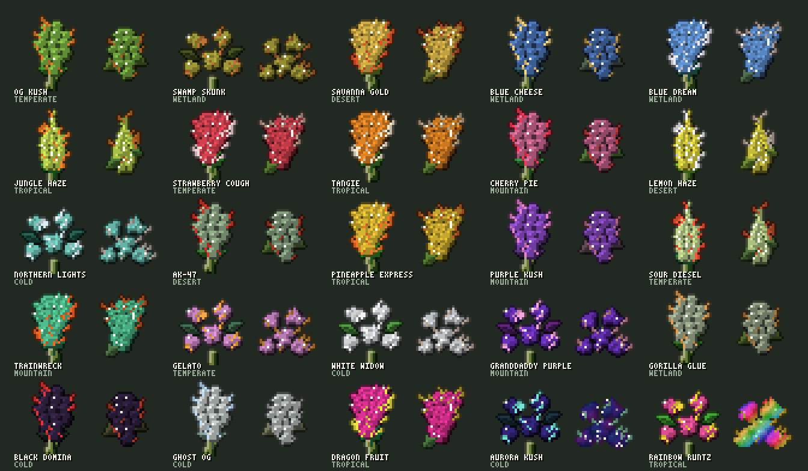
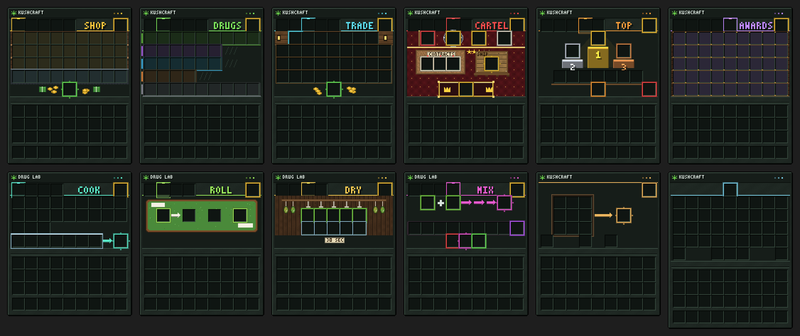
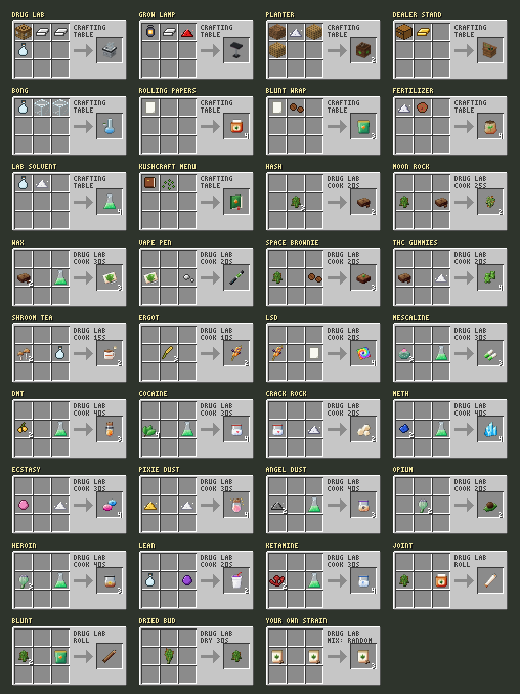

# KushCraft 3.0 – grow, cook & deal (Paper 26.3)

A **server-side only** Paper plugin with 25 unique strains, climates, custom plants, 22 drugs, strain breeding with very rare Mythic strains, cartels, a sales leaderboard, 45 achievements and a living economy. It all comes in **one jar**.
Players don't install any mods. The plugin builds its own resource pack (32px art, 3D plants and blocks, animated Mythic buds, menu art and recipe pictures) and sends it to everyone who joins.

**Download:** [`release/KushCraft-3.0.0.jar`](release/KushCraft-3.0.0.jar). Drop it in `plugins/` and restart.

| Items | Plants | Blocks |
|---|---|---|
|  |  |  |





## The menu

Open it with **`/kush`**, **Shift + F**, or the **KushCraft Menu** book. There are five panels, and your money sits in the corner:

| Panel | What's there |
|---|---|
| **Shop** | seeds of every strain (rarer strains cost more), cheap gear, and selling (click product, or **Sell all**) |
| **Drugs** | every product in one row per kind; click one to see its recipe picture |
| **Trade** | 7 shelves of resources: ores, farming, wood, building blocks, mob drops, nether & end, lab & tools |
| **Cartel** | your cartel (bank, level, members), **contracts**, the cartel **shipment** and **Top Dealers** |
| **Awards** | 45 achievements, greyed out until you unlock them |

The **Drug Lab** block works the same way: it opens on **Cook**, with **Roll**, **Dry** and **Mix** tabs and an **Upgrade** button. Recipes you have everything for glow. One click cooks, using ingredients straight from your inventory.

## Getting started

1. Break grass for seeds (the biome decides the strain), or buy any strain in the Shop. Jungle grass gives coca, red poppies give poppy seeds, desert dead bushes give peyote, small mushrooms give spores and ripe wheat gives **ergot**.
2. Plant them in the right **climate**, wait, then click the plant to harvest.
3. Craft a **Drug Lab** (crafting table + 2 iron + a glass bottle), then dry, roll and cook.
4. Sell your product, start a cartel and sell the most to become the **Cartel Boss**.

## Strains & climates

There are 25 strains and every one looks different: its own bud colour, leaf colour, hair colour and bud shape (**classic**, **foxtail**, **popcorn** or **spear**), plus its own effects, flavour and climate. Seeds cost $15 (Swamp Skunk) up to $240 (Dragon Fruit).

Every strain loves one of six climates (shown on its seeds):

| Climate | Where |
|---|---|
| Tropical | jungles |
| Desert | deserts, savannas, badlands, the Nether |
| Temperate | plains, forests |
| Wetland | swamps, rivers, beaches |
| Cold | snow, taiga, ice |
| Mountain | hills, meadows, cherry groves, anything above y 100 |

In its own climate a plant grows **50% faster**, gets **+1 ★** and **+1 bud**. In the opposite climate it grows at half speed with −1 ★ (a **Grow Lamp** nearby fixes that, like a greenhouse).

### Breeding & Mythic strains

**Drug Lab > Mix:** cross two seeds for $150. The child is random: effects, potency, climate, colours and bud shape come from the parents, or mutate into something new.

About **1 in 70** crosses is **Mythic**: animated **rainbow**, **galaxy**, **golden**, **crystal**, **neon** or **inferno** buds. Mythic plants sparkle (some glow in the dark) and Mythic product sells for 2.5×. A Mythic parent passes its look on about 1 in 5. Two Mythic strains, **Aurora Kush** and **Rainbow Runtz**, can very rarely be found in the wild.

## Drugs (Drug Lab > Cook)

Every recipe needs **1 or 2** cheap things and takes 10–40 seconds. Everyone can cook everything.

| Weed | Psychedelics | Uppers | Downers |
|---|---|---|---|
| Hash, Moon Rock, Wax, Vape Pen, Space Brownie, THC Gummies | Shroom Tea, **Ergot → LSD**, Mescaline, DMT | Cocaine, Crack, Meth, Ecstasy, Pixie Dust, Angel Dust | Opium, Heroin, Lean, Ketamine |

**LSD:** cook 3 wheat into ergot (or find ergot when you harvest ripe wheat), then ergot + paper = 4 tabs.
**Drying:** every Drug Lab has **5 drying racks**; buds are dry in **30 seconds**.

Joints and blunts come from Roll; magic mushrooms and peyote buttons are eaten raw. Here's every recipe:



## Cartels

Start a cartel for $2,500 (Cartel panel), invite players from the members list, or `/kush cartel invite <player>`.

* **Bank:** every sale a member makes adds **5%** on top into the bank (nobody pays it), and contracts add 10% of their reward. Members put money in; the boss takes it out.
* **Levels:** the boss spends the bank on levels. Every member gets the bonus:

| Level | Cost | Members | Sales | Growth | Lab speed |
|---|---|---|---|---|---|
| Crew | – | 4 | – | – | – |
| Gang | $10,000 | 6 | +3% | +5% | – |
| Syndicate | $40,000 | 8 | +6% | +10% | +5% |
| Cartel | $120,000 | 12 | +9% | +15% | +10% |
| Empire | $350,000 | 16 | +12% | +20% | +15% |

* **Shipments:** each cartel gets a big order, e.g. 75 cocaine within 24 hours. Every member can deliver part of it and gets paid the normal price for it; when it's full the bank gets a big bonus.
* **Contracts:** three batch orders anyone can fill for bonus cash.
* **Top Dealers:** the best players and the best cartels (switch with the button in the corner).

## Dealer titles: whoever sells the most

| Place | Title | Bonus on every sale |
|---|---|---|
| #1 | Cartel Boss | +15% |
| #2 | Kingpin | +12% |
| #3 | The Plug | +10% |
| top 5 | Supplier | +7% |
| top 10 | Hustler | +5% |
| top 25 | Dealer | +2% |
| everyone else | Street Seller | – |

Titles and cartels show in the tab list.

## Economy

* **Cheap to start:** seeds $15–240 by strain, papers $5, solvent 8 for $10, a Drug Lab $400 (or craft one). Lab upgrades $1,500 to $40,000.
* **Product pays well**, e.g. dried bud $15, cocaine $80, heroin $110, a vape pen $320. Rarer and stronger strains sell for more (Mythic 2.5×). Selling lots of one thing lowers its price for a while, and one **hot item** pays +50%.
* **Resources are expensive.** Trade has 187 resources on 7 shelves: a diamond costs $1,500, an iron ingot $80, an elytra $250,000. Resources sell back for 20%, and prices move as people buy and sell.
* Jobs (mining, farming, hunting, growing) pay a little on the side.
* Built-in wallet, or **Vault** (EssentialsX, CMI…) if installed. Every number is in `config.yml`.

## Achievements

There are 45 awards, each with a cash reward: grow in every climate, fill all 5 drying racks, cook LSD, deliver a cartel shipment, build an Empire, breed a Mythic strain, sell $1,000,000, become the #1 seller and more. They're also real **advancements**: unlocking one pops the usual toast, and they have their own *KushCraft* tab in the advancements screen (L).

## Installing

1. **Paper 26.3** (Java 25). Put the jar in `plugins/` and start the server.
2. Players need the texture pack. KushCraft hosts it on **port 8163**. Open that port, **or** (most game hosts, e.g. Shockbyte) use the hosted copy:
   ```yaml
   # plugins/KushCraft/config.yml
   resource-pack:
     url: 'https://raw.githubusercontent.com/Monkevr689/ypm/claude/inspiring-keller-65lzp9/kushcraft/release/KushCraft-pack.zip'
   ```
3. Join and accept the pack.

**Updating from 2.x:** replace the jar and restart.
* `config.yml` upgrades itself to version 6: the new shop prices, Trade shelves, drying time and cartel settings are written in; your `resource-pack.url` and other settings are kept.
* `strains.yml` gets the 15 new strains and the new looks and climates; strains your players bred are kept.

## Commands (optional – everything is in the menu)

| Command | Permission | |
|---|---|---|
| `/kush` (`/k`) | `kushcraft.use` | the menu |
| `/kush shop` / `drugs` / `trade` / `cartel` / `top` / `awards` | `kushcraft.use` | open a panel |
| `/kush cartel invite <player>` / `join <cartel>` / `leave` | `kushcraft.use` | cartels |
| `/kush pay <player> <amount>` | `kushcraft.use` | send money |
| `/kush guide` / `pack` / `balance` / `strains` | `kushcraft.use` | handbook, re-send the pack, your money, all strains |
| `/kush items` | `kushcraft.admin` | click any item to get it |
| `/kush give <player> <item> [amount] [strain] [quality]` | `kushcraft.admin` | |
| `/kush money <player> <amount>` / `sales <player> <amount>` | `kushcraft.admin` | set a balance / lifetime sales |
| `/kush reload` | `kushcraft.admin` | reload the config |
| `/kush selftest` | console | runs the built-in tests |

## Building from source

```bash
cd kushcraft
mvn package                       # JDK 25; jar in target/
python3 tools/gen_assets.py       # redraw all art, menus and recipe pictures (needs Pillow)
python3 tools/validate_pack.py    # checks the pack against the Java code
python3 tools/make_pack_zip.py    # release/KushCraft-pack.zip for hosting
```

GitHub Actions builds against the real Paper 26.3 API, boots a real Paper 26.3 server to run `/kush selftest` (including the advancement tab), and tests the hosted pack and the upgrade from 2.0.
